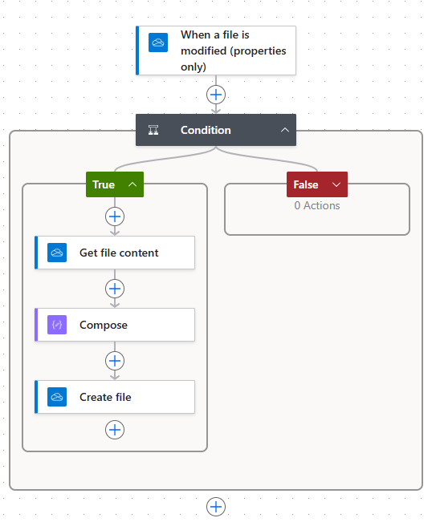
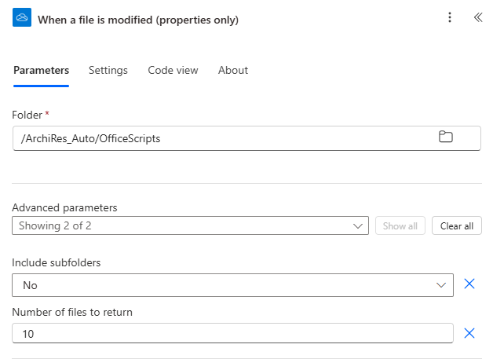
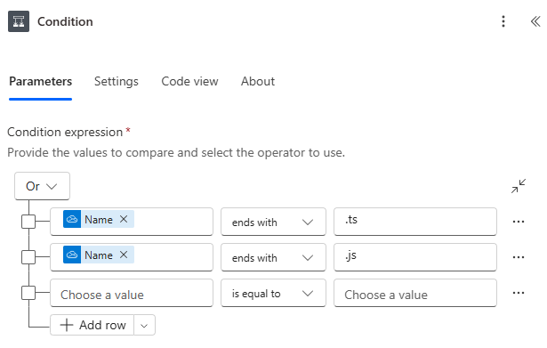
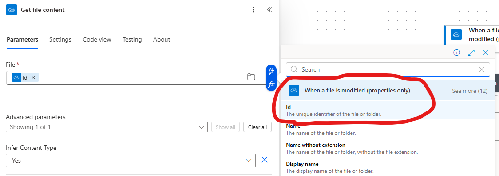
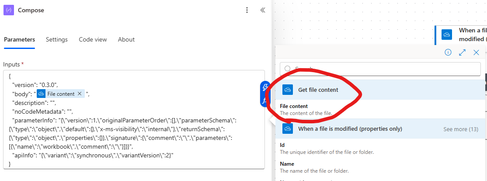
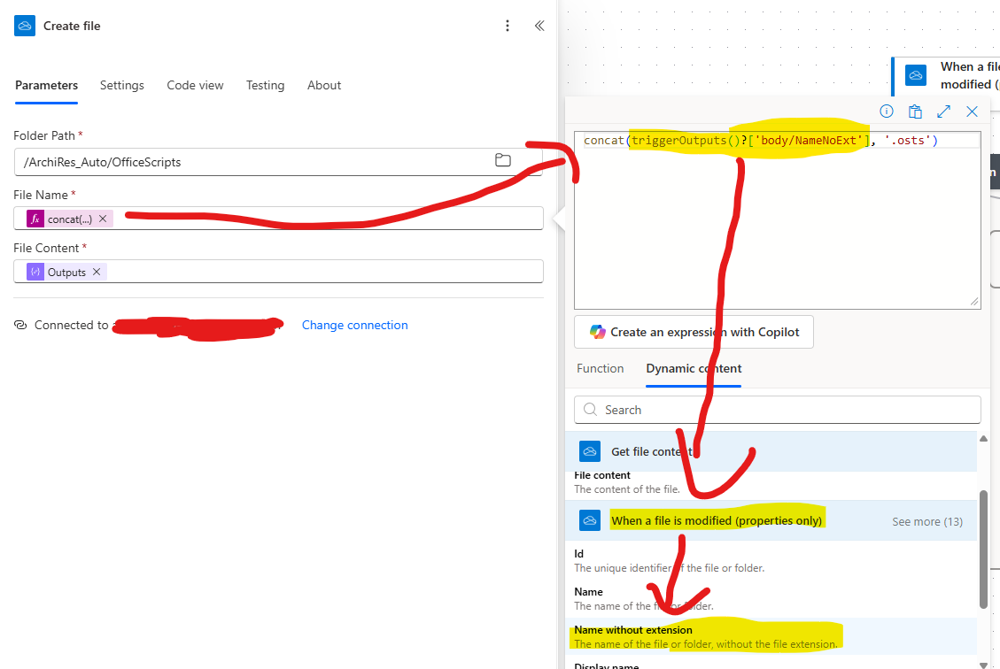

# Flux de transformation des fichiers Javascript / Typescript vers Office Script

**Littéralement un copier-coller de [la réponse de AymKdn le 11 novembre 2025 sur la question _Editing Office Scripts in Visual Studio Code_ dans StackOverflow](https://stackoverflow.com/questions/61477389/editing-office-scripts-in-visual-studio-code#answer-79816457)**

## Étapes

_Note : dans OneDrive, créer un dossier dédié avant._

* 1) Déclencheur : _OneDrive for Business : When a file is modified (properties only)_ :
  * _Folder_ : le dossier dédié créé
  * _Advanced parameters_ → _Include subfolders_ : _Yes__
* 2) _Condition_ :
  * Utiliser l'opérateur _Or_
  * 1. _Name_ (de l'étape précédente) → _ends with_ → _.ts_
  * 2. _Name_ (de l'étape précédente) → _ends with_ → _.js_

Dans _True_ :

* 3) _OneDrive for Business : Get file content_ :
  * _File_ : _Id_ (de l'étape précédente)
* 4) _Compose_ :
  * Le code ci-dessous
  * Ce qui suit `"body"` doit être le _File content_ de l'étape précédente

``` JSON
{
  "version": "0.3.0",
  "body": "@{body('Get_file_content')}",
  "description": "",
  "noCodeMetadata": "",
  "parameterInfo": "{\"version\":1,\"originalParameterOrder\":[],\"parameterSchema\":{\"type\":\"object\",\"default\":{},\"x-ms-visibility\":\"internal\"},\"returnSchema\":{\"type\":\"object\",\"properties\":{}},\"signature\":{\"comment\":\"\",\"parameters\":[{\"name\":\"workbook\",\"comment\":\"\"}]}}",
  "apiInfo": "{\"variant\":\"synchronous\",\"variantVersion\":2}"
}
```

5) _OneDrive for Business : Create file_ :

* _Folder path_ : `substring(triggerOutputs()?['body/Path'], 0, lastIndexOf(triggerOutputs()?['body/Path'], '/'))`
  * `triggerOutputs()?['body/Path']` = _Path_ de la première étape
* _File Name_ : `concat(triggerOutputs()?['body/NameNoExt'], '.osts')
  * `triggerOutputs()?['body/NameNoExt']` = _Name without extension_ de la première étape
* _File Content_ : l'output de l'étape précédente



## Illustration du paramétrage de chaque étape

Paramétrage du déclencheur :



Paramétrage de la condition :



Paramétrage de la récupération du contenu du fichier :



Paramétrage du compose :



Paramétrage de la création du nouveau fichier :

