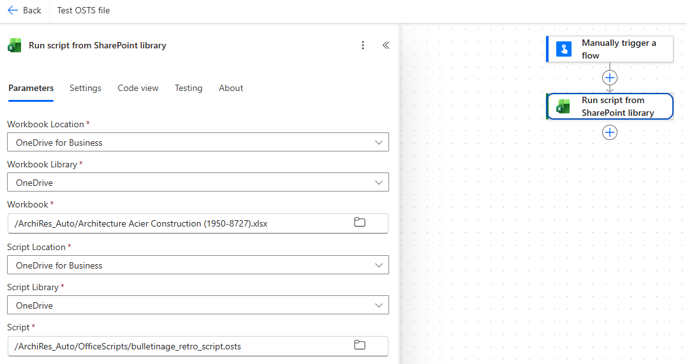

# Flux permettant de tester le script uniquement

FLux basique servant à tester le fonctionnement du script de transformation du fichier Excel sans passer par tout le circuit

## Étapes

_Note : dans OneDrive, téléverser le fichier de test avant._

* 1) Déclencheur : _Manually trigger a flow_
* 2) _Excel Online (Business) : Run script from SharePoint library_ :
  * _Workbook Location_ : _OneDrive for Business_
  * _Workbook Library_ : _OneDrive_
  * _Workbook_ : sélectionner le fichier de test
  * _Script Location_ : _OneDrive for Business_
  * _Script Library_ : _OneDrive_
  * _Script_ : sélectionner le fichier _.osts_ du script

